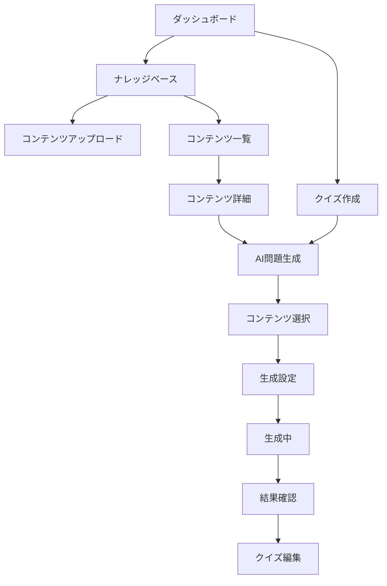

# AI問題自動生成 ユーザーストーリーと画面設計

## 1. ユーザーストーリー

### 1.1 高校教師：田中先生の場合

**背景**: 数学を担当する田中先生は、毎月の小テスト作成に2〜3時間かかっていた。

**ストーリー**:
```
1. 期末試験の範囲である「二次関数」の章のPDFをアップロード
2. システムが自動的に重要な概念を抽出
3. 「基礎問題7割、応用問題3割で20問作成」を指定
4. 30秒後、問題案が表示される
5. 気に入らない問題を2〜3個修正
6. 「クイズに追加」をクリックして完了
```

**価値**: 従来3時間かかっていた作業が15分で完了

### 1.2 企業研修担当：鈴木さんの場合

**背景**: 新入社員研修の理解度チェックテストを毎回手作りしていた。

**ストーリー**:
```
1. 研修マニュアル（Word）を分野別にアップロード
2. 「ビジネスマナー」「情報セキュリティ」など、カテゴリーに整理
3. 各分野から均等に出題されるよう設定
4. 4択問題30問を一括生成
5. 各問題に自動生成された解説を確認
6. eラーニングシステムに直接エクスポート
```

**価値**: 属人化していた問題作成が標準化され、品質が向上

### 1.3 塾講師：山田先生の場合

**背景**: 生徒ごとにレベルの異なる問題を用意する必要があった。

**ストーリー**:
```
1. 使用している問題集をスキャンしてアップロード
2. 基礎・標準・発展の3レベルを設定
3. 生徒Aには基礎8割、生徒Bには発展8割で生成
4. 同じ単元でも異なる難易度の問題セットが完成
5. 生徒の理解度に応じて追加問題も即座に生成
```

**価値**: 個別指導の質が向上し、生徒満足度がアップ

## 2. 画面遷移フロー



## 3. 詳細画面設計

### 3.1 ナレッジベース - ホーム画面

```
┌─────────────────────────────────────────────────────────┐
│ ExamForge                           👤 田中太郎 ▼       │
├─────────────────────────────────────────────────────────┤
│                                                         │
│  📚 ナレッジベース                                      │
│                                                         │
│  ┌───────────────┐  ┌───────────────┐  ┌───────────┐ │
│  │   📁          │  │   📄          │  │   🔗      │ │
│  │ ファイルを    │  │ テキストを    │  │ Webから   │ │
│  │ アップロード  │  │   入力       │  │  取り込み  │ │
│  └───────────────┘  └───────────────┘  └───────────┘ │
│                                                         │
│  最近追加したコンテンツ                                 │
│  ┌─────────────────────────────────────────────────┐ │
│  │ 📄 二次関数の基礎.pdf        2024/03/15  数学    │ │
│  │ 📄 英語長文読解テキスト.docx  2024/03/14  英語    │ │
│  │ 🔗 物理基礎まとめサイト      2024/03/13  物理    │ │
│  └─────────────────────────────────────────────────┘ │
│                                                         │
│  [すべて見る →]                                        │
│                                                         │
└─────────────────────────────────────────────────────────┘
```

### 3.2 ファイルアップロード画面

```
┌─────────────────────────────────────────────────────────┐
│ [←] ファイルをアップロード                              │
├─────────────────────────────────────────────────────────┤
│                                                         │
│  ┌ ─ ─ ─ ─ ─ ─ ─ ─ ─ ─ ─ ─ ─ ─ ─ ─ ─ ─ ─ ─ ┐      │
│  │                                             │      │
│  │         📁 ここにファイルをドロップ          │      │
│  │                                             │      │
│  │              または                         │      │
│  │                                             │      │
│  │         [ファイルを選択]                    │      │
│  │                                             │      │
│  └ ─ ─ ─ ─ ─ ─ ─ ─ ─ ─ ─ ─ ─ ─ ─ ─ ─ ─ ─ ─ ┘      │
│                                                         │
│  対応形式: PDF, Word, テキスト, 画像                    │
│  最大サイズ: 50MB                                      │
│                                                         │
│  アップロード予定:                                      │
│  ┌─────────────────────────────────────────────────┐ │
│  │ ✓ 二次関数.pdf (2.3MB)              [削除]      │ │
│  │ ✓ 練習問題.docx (1.5MB)             [削除]      │ │
│  └─────────────────────────────────────────────────┘ │
│                                                         │
│  分野を選択: [数学 ▼]                                  │
│  タグ: [#二次関数 #期末試験_____]                      │
│                                                         │
│  [キャンセル]                        [アップロード]     │
│                                                         │
└─────────────────────────────────────────────────────────┘
```

### 3.3 AI問題生成 - スタート画面

```
┌─────────────────────────────────────────────────────────┐
│ [←] クイズ作成 > AI問題生成                            │
├─────────────────────────────────────────────────────────┤
│                                                         │
│     🤖 AIが問題を自動生成します                         │
│                                                         │
│  ┌───────────────────────────────────────────────┐   │
│  │                                               │   │
│  │  どこから問題を生成しますか？                  │   │
│  │                                               │   │
│  │  ○ ナレッジベースから選ぶ                    │   │
│  │     登録済みの教材から問題を生成              │   │
│  │                                               │   │
│  │  ○ 新しくアップロードする                    │   │
│  │     ファイルをアップロードして問題を生成       │   │
│  │                                               │   │
│  │  ○ テキストを直接入力                       │   │
│  │     テキストを入力して問題を生成              │   │
│  │                                               │   │
│  └───────────────────────────────────────────────┘   │
│                                                         │
│  使い方のヒント:                                        │
│  • 教科書や参考書のPDFから問題を作成できます          │
│  • 複数の資料を組み合わせることも可能です             │
│  • 生成後に問題を編集することができます               │
│                                                         │
│                              [次へ: コンテンツ選択 →]   │
│                                                         │
└─────────────────────────────────────────────────────────┘
```

### 3.4 コンテンツ選択画面（改良版）

```
┌─────────────────────────────────────────────────────────┐
│ AI問題生成 (1/4)                              [？ヘルプ] │
├─────────────────────────────────────────────────────────┤
│                                                         │
│  📚 出題範囲を選択                                      │
│                                                         │
│  分野で絞り込み: [すべて ▼] [数学 ▼] [二次関数 ▼]    │
│                                                         │
│  ┌─────────────────────────────────────────────────┐ │
│  │ □ 二次関数の基礎                               │ │
│  │    📄 PDF・15ページ・2024/03/15                │ │
│  │    タグ: #基礎 #グラフ #平方完成               │ │
│  ├─────────────────────────────────────────────────┤ │
│  │ □ 二次関数の応用                               │ │
│  │    📄 Word・8ページ・2024/03/10                 │ │
│  │    タグ: #応用 #最大最小 #実生活               │ │
│  ├─────────────────────────────────────────────────┤ │
│  │ □ 練習問題集                                   │ │
│  │    📄 PDF・25ページ・2024/03/05                │ │
│  │    タグ: #問題集 #解答付き                     │ │
│  └─────────────────────────────────────────────────┘ │
│                                                         │
│  選択中: 0件                                           │
│  推奨: 関連性の高いコンテンツを2〜3件選択             │
│                                                         │
│  [キャンセル]    [← 戻る]    [次へ: 問題設定 →]       │
│                                                         │
└─────────────────────────────────────────────────────────┘
```

### 3.5 問題設定画面（シンプル版）

```
┌─────────────────────────────────────────────────────────┐
│ AI問題生成 (2/4)                                        │
├─────────────────────────────────────────────────────────┤
│                                                         │
│  ⚙️ どんな問題を作成しますか？                          │
│                                                         │
│  基本設定                                              │
│  ┌─────────────────────────────────────────────────┐ │
│  │ 問題数:     [10 ▼] 問                          │ │
│  │                                                 │ │
│  │ 問題形式:   ☑ 選択式（4択）                    │ │
│  │            ☑ 正誤問題                         │ │
│  │            □ 穴埋め問題                       │ │
│  │            □ 記述式                           │ │
│  │                                                 │ │
│  │ 難易度:     ○ やさしい（基礎の確認）           │ │
│  │            ● ふつう（バランス重視）            │ │
│  │            ○ むずかしい（応用・発展）          │ │
│  └─────────────────────────────────────────────────┘ │
│                                                         │
│  詳細設定 ▼                                           │
│                                                         │
│  推定生成時間: 約30秒                                  │
│                                                         │
│  [キャンセル]    [← 戻る]    [次へ: 確認 →]          │
│                                                         │
└─────────────────────────────────────────────────────────┘
```

### 3.6 生成中画面

```
┌─────────────────────────────────────────────────────────┐
│ AI問題生成 (3/4)                                        │
├─────────────────────────────────────────────────────────┤
│                                                         │
│                                                         │
│              🤖 問題を生成しています...                  │
│                                                         │
│              ████████████░░░░░░░░░ 60%                 │
│                                                         │
│              生成済み: 6/10問                           │
│              残り時間: 約15秒                           │
│                                                         │
│                                                         │
│  現在の処理:                                           │
│  ✓ コンテンツ分析完了                                 │
│  ✓ 重要概念の抽出完了                                 │
│  ⚡ 問題生成中...                                      │
│  ○ 品質チェック                                       │
│                                                         │
│                                                         │
│              [バックグラウンドで続行]                   │
│                                                         │
└─────────────────────────────────────────────────────────┘
```

### 3.7 生成結果確認画面（カード形式）

```
┌─────────────────────────────────────────────────────────┐
│ AI問題生成 (4/4) - 完了                     [一括操作 ▼] │
├─────────────────────────────────────────────────────────┤
│                                                         │
│  ✅ 10問の問題が生成されました                          │
│                                                         │
│  ┌─────────────────────────────────────────────────┐ │
│  │ Q1. 選択式・初級                    ☑選択       │ │
│  │                                                 │ │
│  │ 二次関数 y = x² - 4x + 3 の頂点の座標は？      │ │
│  │                                                 │ │
│  │ A) (2, -1) ✓   B) (2, 1)                      │ │
│  │ C) (-2, -1)    D) (-2, 1)                     │ │
│  │                                                 │ │
│  │ [プレビュー] [編集] [削除]                     │ │
│  └─────────────────────────────────────────────────┘ │
│  ┌─────────────────────────────────────────────────┐ │
│  │ Q2. 正誤・中級                      ☑選択       │ │
│  │                                                 │ │
│  │ 「すべての二次関数は必ず x 軸と交わる」        │ │
│  │ この文は正しいか？                             │ │
│  │                                                 │ │
│  │ 正答: ✗ 誤り                                   │ │
│  │                                                 │ │
│  │ [プレビュー] [編集] [削除]                     │ │
│  └─────────────────────────────────────────────────┘ │
│                                                         │
│  選択: 10/10問                                         │
│                                                         │
│  [もう一度生成]     [選択した問題をクイズに追加 →]     │
│                                                         │
└─────────────────────────────────────────────────────────┘
```

### 3.8 問題編集画面（インライン編集）

```
┌─────────────────────────────────────────────────────────┐
│ [←] 問題を編集                                          │
├─────────────────────────────────────────────────────────┤
│                                                         │
│  問題種別: [選択式（4択） ▼]   難易度: [初級 ▼]       │
│                                                         │
│  問題文:                                               │
│  ┌─────────────────────────────────────────────────┐ │
│  │ 二次関数 y = x² - 4x + 3 の頂点の座標は？       │ │
│  └─────────────────────────────────────────────────┘ │
│                                                         │
│  選択肢:                              正答             │
│  A: [(2, -1)_______________]           ●              │
│  B: [(2, 1)________________]           ○              │
│  C: [(-2, -1)______________]           ○              │
│  D: [(-2, 1)_______________]           ○              │
│  [+ 選択肢を追加]                                     │
│                                                         │
│  解説: (任意)                                         │
│  ┌─────────────────────────────────────────────────┐ │
│  │ 平方完成により、y = (x - 2)² - 1 と変形でき、  │ │
│  │ 頂点の座標は (2, -1) となります。              │ │
│  └─────────────────────────────────────────────────┘ │
│                                                         │
│  配点: [2] 点    制限時間: [なし ▼]                   │
│                                                         │
│  [キャンセル]                         [変更を保存]     │
│                                                         │
└─────────────────────────────────────────────────────────┘
```

### 3.9 ナレッジベース詳細画面

```
┌─────────────────────────────────────────────────────────┐
│ [←] 二次関数の基礎                    [⚙️] [編集] [削除] │
├─────────────────────────────────────────────────────────┤
│                                                         │
│  📊 利用状況                                           │
│  ┌─────────────────────────────────────────────────┐ │
│  │ 生成した問題数: 156問                           │ │
│  │ 最終利用: 2024/03/20 14:30                     │ │
│  │ 平均正答率: 72%                                │ │
│  └─────────────────────────────────────────────────┘ │
│                                                         │
│  📋 基本情報                                           │
│  ┌─────────────────────────────────────────────────┐ │
│  │ 分野: 数学 > 代数 > 二次関数                   │ │
│  │ 対象: 高校1年生                               │ │
│  │ ファイル: textbook_ch3.pdf (2.3MB)            │ │
│  │ ページ数: 15ページ                             │ │
│  │ 登録日: 2024/03/15                            │ │
│  │ 登録者: 田中太郎                              │ │
│  └─────────────────────────────────────────────────┘ │
│                                                         │
│  🏷️ タグ                                              │
│  [#二次関数] [#グラフ] [#頂点] [#平方完成] [+追加]    │
│                                                         │
│  📄 内容プレビュー                                     │
│  ┌─────────────────────────────────────────────────┐ │
│  │ 第3章 二次関数                                 │ │
│  │                                                │ │
│  │ 3.1 二次関数とは                               │ │
│  │ 二次関数は y = ax² + bx + c (a≠0) の形で...   │ │
│  │                                                │ │
│  │ [全文を表示]                                   │ │
│  └─────────────────────────────────────────────────┘ │
│                                                         │
│  [このコンテンツから問題を生成]                        │
│                                                         │
└─────────────────────────────────────────────────────────┘
```

## 4. モバイル対応設計

### 4.1 スマートフォン画面（問題生成）

```
┌─────────────────────┐
│ ≡  AI問題生成    ？ │
├─────────────────────┤
│                     │
│ 📚 コンテンツ選択   │
│                     │
│ □ 二次関数の基礎   │
│    PDF・15ページ    │
│                     │
│ □ 二次関数の応用   │
│    Word・8ページ    │
│                     │
│ 選択: 0件           │
│                     │
│ ─────────────────── │
│                     │
│ 問題数: [10 ▼]     │
│                     │
│ 形式:              │
│ ☑ 選択式           │
│ ☑ 正誤             │
│                     │
│ 難易度:            │
│ ● ふつう           │
│                     │
│ [生成開始]         │
│                     │
└─────────────────────┘
```

### 4.2 タブレット画面（結果確認）

```
┌───────────────────────────────────┐
│ AI問題生成 - 完了          [×]   │
├───────────────────────────────────┤
│                                   │
│ ✅ 10問生成されました              │
│                                   │
│ ┌─────────────────────────────┐ │
│ │ Q1. 選択式         ☑      │ │
│ │ 二次関数の頂点は？         │ │
│ │ [編集] [削除]             │ │
│ └─────────────────────────────┘ │
│ ┌─────────────────────────────┐ │
│ │ Q2. 正誤          ☑      │ │
│ │ 判別式D>0のとき...        │ │
│ │ [編集] [削除]             │ │
│ └─────────────────────────────┘ │
│                                   │
│ [すべて選択]                      │
│ [クイズに追加]                    │
│                                   │
└───────────────────────────────────┘
```

## 5. アクセシビリティ配慮

### 5.1 キーボード操作
- Tab キーでフォーカス移動
- Enter キーで選択・実行
- Esc キーでキャンセル・閉じる
- 矢印キーでリスト内移動

### 5.2 スクリーンリーダー対応
- 適切な見出し構造（h1〜h3）
- フォーム要素のラベル付け
- 進捗状況の音声読み上げ
- エラーメッセージの明確な通知

### 5.3 視覚的配慮
- 十分なコントラスト比（WCAG AA準拠）
- 色だけに依存しない情報伝達
- フォーカス状態の明確な表示
- 文字サイズの調整可能

## 6. エラー処理とフィードバック

### 6.1 エラー表示例

```
┌─────────────────────────────────────┐
│ ⚠️ エラーが発生しました             │
│                                     │
│ ファイルの処理中に問題が発生しまし   │
│ た。ファイルが破損している可能性が   │
│ あります。                         │
│                                     │
│ エラーコード: E2001                │
│                                     │
│ [別のファイルを選択] [サポート]     │
└─────────────────────────────────────┘
```

### 6.2 成功時のフィードバック

```
┌─────────────────────────────────────┐
│ ✅ 正常に完了しました               │
│                                     │
│ 10問の問題がクイズに追加されました。 │
│                                     │
│ [クイズを確認] [続けて生成]         │
└─────────────────────────────────────┘
```

## 7. パフォーマンス指標の表示

### 7.1 生成品質レポート

```
┌─────────────────────────────────────────────────────────┐
│ 📊 生成レポート                                         │
├─────────────────────────────────────────────────────────┤
│                                                         │
│ 生成結果の分析:                                        │
│                                                         │
│ • 問題の多様性: ★★★★☆ (良好)                         │
│ • 難易度の分布: ★★★★★ (設定通り)                     │
│ • 出題範囲網羅: ★★★☆☆ (一部偏りあり)                 │
│                                                         │
│ 推奨事項:                                              │
│ • 「関数の応用」からも出題を増やすことをお勧めします    │
│ • 記述式問題を追加すると、より深い理解度を測れます     │
│                                                         │
│                                         [閉じる]       │
└─────────────────────────────────────────────────────────┘
```