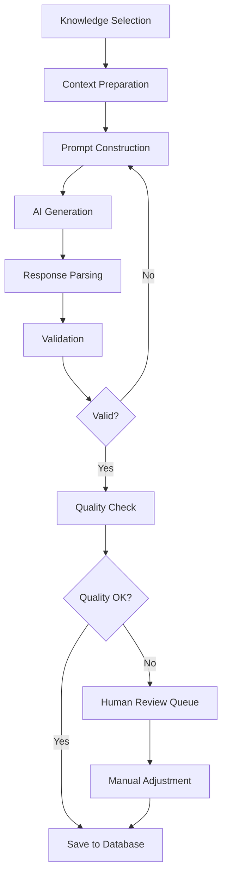

# AI Question Generation Architecture

## Overview

This document outlines the architecture for AI-powered automatic question generation in ExamForge, leveraging the Knowledge Base system to create high-quality, contextually relevant quiz questions.

## Architecture Components

### 1. AI Service Layer

```typescript
// Core AI Service Interface
interface AIQuestionGenerator {
  generateQuestions(params: GenerationParams): Promise<GeneratedQuestion[]>
  validateQuestion(question: Question): Promise<ValidationResult>
  enhanceQuestion(question: Question): Promise<Question>
  calibrateDifficulty(question: Question): Promise<DifficultyLevel>
}

// Generation Parameters
interface GenerationParams {
  knowledgeEntryIds: string[]
  templateId: string
  count: number
  questionTypes?: QuestionType[]
  difficulty?: DifficultyLevel
  language?: string
  customInstructions?: string
}
```

### 2. AI Provider Abstraction

```typescript
// Provider interface for multiple AI services
interface AIProvider {
  name: string
  generateCompletion(prompt: string, options: AIOptions): Promise<AIResponse>
  generateEmbedding(text: string): Promise<number[]>
  moderateContent(content: string): Promise<ModerationResult>
}

// Implementations
class OpenAIProvider implements AIProvider { }
class AnthropicProvider implements AIProvider { }
class GeminiProvider implements AIProvider { }
```

### 3. Question Generation Pipeline



## Implementation Details

### 1. Knowledge Context Preparation

```typescript
class KnowledgeContextBuilder {
  async buildContext(entryIds: string[]): Promise<GenerationContext> {
    // Fetch knowledge entries
    const entries = await this.fetchEntries(entryIds)
    
    // Extract key concepts
    const concepts = await this.extractConcepts(entries)
    
    // Build relationships
    const relationships = await this.mapRelationships(concepts)
    
    // Create structured context
    return {
      primaryContent: this.formatPrimaryContent(entries),
      concepts: concepts,
      relationships: relationships,
      metadata: this.aggregateMetadata(entries)
    }
  }
  
  private async extractConcepts(entries: KnowledgeEntry[]): Promise<Concept[]> {
    // Use NLP to extract key concepts
    // Can use spaCy, NLTK, or AI services
  }
}
```

### 2. Prompt Engineering System

```typescript
class PromptEngine {
  private templates = new Map<string, PromptTemplate>()
  
  async constructPrompt(
    template: QuestionTemplate,
    context: GenerationContext,
    params: GenerationParams
  ): Promise<string> {
    const basePrompt = template.prompt
    
    // Variable substitution
    const prompt = this.substituteVariables(basePrompt, {
      content: context.primaryContent,
      concepts: context.concepts.join(', '),
      difficulty: params.difficulty,
      questionType: params.questionTypes?.[0],
      language: params.language || 'en'
    })
    
    // Add examples if available
    const examples = await this.getExamples(template.id)
    if (examples.length > 0) {
      return this.addExamples(prompt, examples)
    }
    
    return prompt
  }
}
```

### 3. Question Type Generators

```typescript
// Multiple Choice Generator
class MultipleChoiceGenerator {
  async generate(context: GenerationContext): Promise<MultipleChoiceQuestion> {
    const prompt = `
      Create a multiple choice question based on the following content:
      ${context.primaryContent}
      
      Requirements:
      - One correct answer
      - Three plausible but incorrect distractors
      - Clear, unambiguous wording
      - Test understanding, not memorization
      
      Format your response as JSON:
      {
        "question": "...",
        "options": [
          {"text": "...", "isCorrect": true},
          {"text": "...", "isCorrect": false},
          {"text": "...", "isCorrect": false},
          {"text": "...", "isCorrect": false}
        ],
        "explanation": "..."
      }
    `
    
    const response = await this.aiProvider.generateCompletion(prompt)
    return this.parseResponse(response)
  }
}

// True/False Generator
class TrueFalseGenerator {
  async generate(context: GenerationContext): Promise<TrueFalseQuestion> {
    // Similar implementation
  }
}

// Short Answer Generator
class ShortAnswerGenerator {
  async generate(context: GenerationContext): Promise<ShortAnswerQuestion> {
    // Implementation with answer key generation
  }
}

// Fill in the Blank Generator
class FillInBlankGenerator {
  async generate(context: GenerationContext): Promise<FillInBlankQuestion> {
    // Smart blank placement using NLP
  }
}
```

### 4. Validation and Quality Assurance

```typescript
class QuestionValidator {
  async validate(question: GeneratedQuestion): Promise<ValidationResult> {
    const checks = await Promise.all([
      this.checkGrammar(question),
      this.checkClarity(question),
      this.checkAnswerAccuracy(question),
      this.checkDifficulty(question),
      this.checkBias(question),
      this.checkDuplication(question)
    ])
    
    return {
      isValid: checks.every(c => c.passed),
      issues: checks.filter(c => !c.passed).map(c => c.issue),
      score: this.calculateQualityScore(checks)
    }
  }
  
  private async checkAnswerAccuracy(question: GeneratedQuestion): Promise<Check> {
    // Verify answer against knowledge base
    const knowledgeContent = await this.getSourceContent(question.knowledgeIds)
    const verification = await this.aiProvider.generateCompletion(
      `Verify if this answer is correct based on the source material...`
    )
    
    return {
      passed: verification.isCorrect,
      issue: verification.issue
    }
  }
}
```

### 5. Difficulty Calibration

```typescript
class DifficultyCalibrator {
  async calibrate(question: Question): Promise<DifficultyLevel> {
    const factors = await this.analyzeFactors(question)
    
    // Factors to consider:
    // - Cognitive level (Bloom's taxonomy)
    // - Vocabulary complexity
    // - Concept abstractness
    // - Required prior knowledge
    // - Problem-solving steps
    
    const score = this.calculateDifficultyScore(factors)
    
    return this.mapScoreToDifficulty(score)
  }
  
  private analyzeFactors(question: Question): Promise<DifficultyFactors> {
    return {
      bloomsLevel: this.getBloomsLevel(question),
      readability: this.calculateReadability(question.text),
      conceptComplexity: this.assessConceptComplexity(question),
      priorKnowledge: this.estimateRequiredKnowledge(question)
    }
  }
}
```

### 6. Batch Generation Optimization

```typescript
class BatchGenerator {
  async generateBatch(params: BatchGenerationParams): Promise<GeneratedQuestion[]> {
    // Parallel generation with rate limiting
    const chunks = this.chunkRequests(params.count, this.maxConcurrent)
    
    const results = []
    for (const chunk of chunks) {
      const chunkResults = await Promise.all(
        chunk.map(i => this.generateSingle(params))
      )
      results.push(...chunkResults)
      
      // Diversity check
      if (!this.checkDiversity(results)) {
        params.diversityBoost = true
      }
    }
    
    return results
  }
  
  private checkDiversity(questions: GeneratedQuestion[]): boolean {
    // Ensure variety in question types, topics, and difficulty
  }
}
```

## API Implementation

### 1. REST API Endpoints

```typescript
// Generate questions endpoint
POST /api/ai/generate-questions
{
  "knowledgeEntryIds": ["entry1", "entry2"],
  "templateId": "template1",
  "count": 10,
  "questionTypes": ["MULTIPLE_CHOICE", "TRUE_FALSE"],
  "difficulty": "INTERMEDIATE"
}

// Validate question endpoint
POST /api/ai/validate-question
{
  "questionId": "question1"
}

// Enhance question endpoint
POST /api/ai/enhance-question
{
  "questionId": "question1",
  "enhancements": ["clarity", "distractors", "explanation"]
}

// Batch generation status
GET /api/ai/generation-jobs/:jobId
```

### 2. WebSocket for Real-time Updates

```typescript
// Real-time generation updates
ws.on('generation:start', (data) => {
  console.log(`Starting generation of ${data.count} questions`)
})

ws.on('generation:progress', (data) => {
  console.log(`Generated ${data.completed}/${data.total} questions`)
})

ws.on('generation:complete', (data) => {
  console.log(`Generation complete: ${data.questions}`)
})
```

## Integration with ExamForge

### 1. UI Components

```typescript
// AI Generation Modal
export function AIGenerationModal({ quizId }: Props) {
  const [selectedKnowledge, setSelectedKnowledge] = useState<string[]>([])
  const [generating, setGenerating] = useState(false)
  
  const handleGenerate = async () => {
    setGenerating(true)
    
    const result = await generateQuestions({
      knowledgeEntryIds: selectedKnowledge,
      count: 10,
      templateId: selectedTemplate
    })
    
    // Add to quiz
    await addQuestionsToQuiz(quizId, result.questions)
  }
  
  return (
    <Modal>
      <KnowledgeSelector onSelect={setSelectedKnowledge} />
      <GenerationOptions />
      <Button onClick={handleGenerate} loading={generating}>
        Generate Questions
      </Button>
    </Modal>
  )
}
```

### 2. Review Workflow

```typescript
// Question Review Component
export function QuestionReviewPanel({ questionId }: Props) {
  const question = useGeneratedQuestion(questionId)
  
  const handleApprove = async () => {
    await approveQuestion(questionId)
  }
  
  const handleEdit = async (edits: QuestionEdits) => {
    await updateGeneratedQuestion(questionId, edits)
  }
  
  return (
    <Panel>
      <QuestionPreview question={question} />
      <SourceReference entries={question.knowledgeSources} />
      <QualityMetrics score={question.qualityScore} />
      <EditableFields onSave={handleEdit} />
      <ReviewActions onApprove={handleApprove} />
    </Panel>
  )
}
```

## Performance Optimization

### 1. Caching Strategy

```typescript
class AICache {
  // Cache generated questions by knowledge content hash
  async get(contextHash: string): Promise<CachedQuestions | null> {
    return redis.get(`ai:questions:${contextHash}`)
  }
  
  async set(contextHash: string, questions: GeneratedQuestion[]) {
    // Cache for 24 hours
    await redis.setex(`ai:questions:${contextHash}`, 86400, questions)
  }
  
  // Cache embeddings for semantic search
  async getEmbedding(text: string): Promise<number[] | null> {
    const hash = this.hashText(text)
    return redis.get(`ai:embedding:${hash}`)
  }
}
```

### 2. Cost Optimization

```typescript
class CostOptimizer {
  async optimizeGeneration(params: GenerationParams): GenerationParams {
    // Use cheaper models for simple questions
    if (params.difficulty === 'BEGINNER') {
      params.model = 'gpt-3.5-turbo'
    }
    
    // Batch similar requests
    if (this.hasSimilarPending(params)) {
      return this.mergeSimilarRequests(params)
    }
    
    // Use cached results when possible
    const cached = await this.checkCache(params)
    if (cached) {
      params.count -= cached.length
    }
    
    return params
  }
}
```

## Monitoring and Analytics

### 1. Metrics Collection

```typescript
class AIMetrics {
  // Track generation metrics
  async recordGeneration(result: GenerationResult) {
    await this.metrics.record({
      questionsGenerated: result.count,
      tokensUsed: result.tokensUsed,
      duration: result.duration,
      model: result.model,
      teamId: result.teamId,
      templateId: result.templateId,
      successRate: result.successRate
    })
  }
  
  // Track quality metrics
  async recordQuality(questionId: string, metrics: QualityMetrics) {
    await this.metrics.record({
      questionId,
      grammarScore: metrics.grammar,
      clarityScore: metrics.clarity,
      difficultyAccuracy: metrics.difficultyAccuracy,
      studentPerformance: metrics.studentPerformance
    })
  }
}
```

### 2. Dashboard Visualization

```typescript
// Analytics Dashboard Component
export function AIAnalyticsDashboard() {
  const metrics = useAIMetrics()
  
  return (
    <Dashboard>
      <MetricCard
        title="Questions Generated"
        value={metrics.totalGenerated}
        trend={metrics.generationTrend}
      />
      <MetricCard
        title="Average Quality Score"
        value={metrics.avgQuality}
        trend={metrics.qualityTrend}
      />
      <CostBreakdown costs={metrics.costs} />
      <ModelPerformance models={metrics.modelStats} />
      <TemplateEffectiveness templates={metrics.templateStats} />
    </Dashboard>
  )
}
```

## Security and Compliance

### 1. Content Filtering

```typescript
class ContentFilter {
  async filter(content: string): Promise<FilterResult> {
    // Check for inappropriate content
    const moderation = await this.aiProvider.moderateContent(content)
    
    // Check for PII
    const piiCheck = await this.detectPII(content)
    
    // Check for copyrighted content
    const copyrightCheck = await this.checkCopyright(content)
    
    return {
      safe: moderation.safe && !piiCheck.found && !copyrightCheck.found,
      issues: [...moderation.issues, ...piiCheck.issues, ...copyrightCheck.issues]
    }
  }
}
```

### 2. Audit Logging

```typescript
class AIAuditLogger {
  async logGeneration(params: GenerationParams, result: GenerationResult) {
    await this.auditLog.create({
      action: 'AI_GENERATION',
      userId: params.userId,
      teamId: params.teamId,
      params: this.sanitizeParams(params),
      result: {
        questionsGenerated: result.count,
        model: result.model,
        cost: result.estimatedCost
      },
      timestamp: new Date()
    })
  }
}
```

## Future Enhancements

### 1. Advanced Features
- Multi-modal question generation (images, diagrams)
- Adaptive question generation based on student performance
- Cross-lingual question generation
- Question evolution based on feedback

### 2. Integration Possibilities
- LMS integration for automatic quiz creation
- Real-time question generation during lectures
- Personalized practice question generation
- Collaborative question refinement

### 3. AI Model Improvements
- Fine-tuned models for specific subjects
- Reinforcement learning from student performance
- Multi-agent systems for question validation
- Automated question improvement suggestions