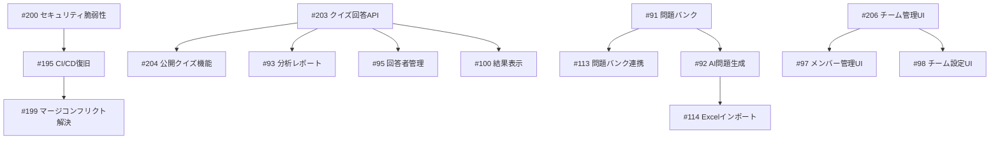

# ExamForge オープンイシュー分析レポート

**作成日**: 2025年6月12日  
**総イシュー数**: 74件  
**分析者**: Claude

## エグゼクティブサマリー

ExamForgeプロジェクトには現在74個のオープンイシューが存在します。これらは大きく以下のカテゴリーに分類されます：

1. **緊急対応が必要な重大イシュー**: 10件（セキュリティ、インフラ、コア機能の欠落）
2. **新機能実装**: 約30件（LMSモード、AI機能、高度な分析機能など）
3. **UI/UX改善**: 約15件（ダッシュボード、エディタ、管理画面など）
4. **プロジェクト管理**: 約10件（リリース計画、優先順位、品質保証など）
5. **バグ修正・改善**: 約9件（既存機能の修正、パフォーマンス改善など）

## 1. カテゴリ別分類

### 1.1 🚨 緊急・重大イシュー（Critical/Release-blocker）

| # | タイトル | 優先度 | 理由 |
|---|---|---|---|
| 200 | CRITICAL SECURITY: Open Redirect & Session Token Bypass | P0 | 6つの重大セキュリティ脆弱性 |
| 203 | Implement Quiz Response Submission API | P0 | コア機能の欠落（クイズ回答不可） |
| 204 | Implement Public Quiz Taking for Anonymous Users | P0 | 基本的なユースケースの欠落 |
| 195 | CI/CD Pipeline Restoration | P0 | 開発・デプロイのブロッカー |
| 199 | Resolve Merge Conflicts Blocking CI Recovery | P0 | CI/CDの復旧に必要 |
| 205 | Replace Dashboard Mock Data with Real Analytics | P1 | ユーザー体験の信頼性 |
| 206 | Build Team Management Interface | P1 | ビジネスモデルの中核機能 |

### 1.2 🔧 バグ修正・技術的改善

| # | タイトル | 優先度 | カテゴリ |
|---|---|---|---|
| 151 | PR #147 セキュリティ問題の修正 | High | セキュリティ |
| 115 | パスワード保護機能の統合修正 | Medium | 機能修正 |
| 185 | 全PRのCI失敗問題を解決 | High | インフラ |
| 174 | E2E以外のテスト成功化 | Medium | テスト |

### 1.3 ✨ 新機能実装

#### 基本機能（v1.0必須候補）
| # | タイトル | 優先度 | 依存関係 |
|---|---|---|---|
| 156 | 基本的なメール通知機能 | High | - |
| 108 | Quiz Editorの自動保存機能 | High | - |
| 111 | Quiz Editor設定パネルの完全実装 | Medium | - |
| 112 | 表紙画像アップロード機能 | Medium | - |

#### 高度な機能（v1.1以降候補）
| # | タイトル | 優先度 | 依存関係 |
|---|---|---|---|
| 91 | 問題バンクシステム | Low | #113と関連 |
| 92 | AI問題自動生成機能 | Low | #91に依存 |
| 93 | クイズ分析・レポートページ | Medium | #203に依存 |
| 94 | 証明書管理システム | Low | - |
| 95 | 回答者管理ページ | Medium | #203に依存 |
| 96 | テンプレート管理システム | Low | - |
| 102 | 高度なクイズ機能 | Low | - |
| 110 | リッチテキストエディタ | Low | - |
| 113 | 問題バンクとの連携 | Low | #91に依存 |
| 114 | Excelインポート・AI生成 | Low | #92に依存 |

#### LMSモード実装（大規模機能）
| # | タイトル | フェーズ | 依存関係 |
|---|---|---|---|
| 99 | LMSモードの実装（概要） | - | #119に統合 |
| 119 | LMSマルチテナンシー実装 | - | 以下に分解 |
| 125-138 | LMS実装の各フェーズ | Phase1-5 | 順次実装 |

### 1.4 🎨 UI/UX改善

| # | タイトル | 優先度 | 依存関係 |
|---|---|---|---|
| 97 | メンバー管理ページUI | High | #206と重複 |
| 98 | チーム設定ページUI | High | #206と関連 |
| 100 | 結果表示専用ページ | Medium | #203に依存 |
| 101 | プラン管理・使用状況ページ | Medium | - |
| 103 | メディア管理機能の強化 | Low | - |
| 109 | セクション管理機能 | Low | - |

### 1.5 📋 プロジェクト管理・ドキュメント

| # | タイトル | 状態 |
|---|---|---|
| 196 | v1.0 Release Planning | 進行中 |
| 197 | Issue Backlog Prioritization | 進行中 |
| 149 | v1.0リリースチェックリスト | 作成済 |
| 150 | 開発優先順位とロードマップ | 作成済 |
| 152 | プロジェクトステータス調査 | 完了候補 |
| 153 | 開発ロードマップ整理 | 作成済 |
| 154 | セキュリティガイドライン | 作成済 |
| 157 | v1.0リリースノート | ドラフト |
| 159 | 包括的テストシナリオ | 作成済 |
| 160 | タスク優先順位 | 日次更新 |
| 162 | 最終品質保証計画 | 作成済 |
| 163 | リリース準備チェックリスト | 作成済 |

### 1.6 🔥 緊急対応・プロセス改善

| # | タイトル | 状態 |
|---|---|---|
| 164-170 | バグ対応プロセス一式 | 進行中 |
| 171-173 | PR管理・開発統制 | 実施中 |
| 181 | 実装済み機能調査 | 進行中 |
| 184 | 機能完成度チェック | 進行中 |

### 1.7 📧 メール・通知システム

| # | タイトル | 優先度 | 依存関係 |
|---|---|---|---|
| 118 | Resendメール配信システム | Medium | #148と重複 |
| 148 | Resendメール配信詳細設計 | Medium | #118と重複 |
| 156 | 基本的なメール通知 | High | v1.0必須 |

## 2. 依存関係の洗い出し

### 2.1 ブロッキングチェーン

### 2.2 重要な依存関係

1. **クイズ回答機能チェーン**
   - #203（API実装）が完了しないと、以下が実装不可：
     - #204（公開クイズ）
     - #93（分析機能）
     - #95（回答者管理）
     - #100（結果表示）

2. **問題バンクチェーン**
   - #91（問題バンク）→ #113（連携）→ #92（AI生成）→ #114（Excel）

3. **チーム管理チェーン**
   - #206（バックエンド実装済み、UI必要）が #97、#98と密接に関連

4. **LMSモードチェーン**
   - #119が親イシューで、#125-138が実装フェーズに分解

## 3. v1.0リリース必須分類

### 3.1 🔴 v1.0必須（Release Blocker）

1. **セキュリティ・インフラ**
   - #200: セキュリティ脆弱性の修正
   - #195, #199: CI/CDの復旧

2. **コア機能**
   - #203: クイズ回答API
   - #204: 公開クイズ機能
   - #205: ダッシュボードの実データ表示
   - #206: チーム管理UI

3. **基本機能**
   - #156: 基本的なメール通知
   - #108: 自動保存機能

### 3.2 🟡 v1.0推奨（Nice to Have）

- #111: Quiz Editor設定パネル完全実装
- #112: 表紙画像アップロード
- #97, #98: チーム関連UI（#206で代替可能）
- #115: パスワード保護機能修正

### 3.3 🟢 v1.1以降（Post-release）

- #91-96: 高度な機能（問題バンク、AI、証明書など）
- #99, #119, #125-138: LMSモード
- #102: 高度なクイズ機能
- #103: メディア管理強化
- #109, #110, #113, #114: エディタ拡張機能

## 4. 実装難易度と工数概算

### 4.1 工数別分類

| 工数 | イシュー番号 | 説明 |
|---|---|---|
| **1-2日** | #205, #156, #108, #115, #174 | 既存機能の修正・改善 |
| **2-3日** | #203, #111, #112, #97, #98, #100, #101 | 単一機能の実装 |
| **3-5日** | #204, #206, #93, #95, #103 | 複雑なUI/機能実装 |
| **1週間以上** | #91, #92, #94, #96, #102, #110 | 大規模な新機能 |
| **1ヶ月以上** | #99/119（LMSモード全体） | システム全体の拡張 |

### 4.2 技術的難易度

**高難易度**
- #200: セキュリティ脆弱性（慎重な対応必要）
- #92: AI問題生成（外部API統合）
- #119: マルチテナンシー（アーキテクチャ変更）

**中難易度**
- #203: クイズ回答API（データモデル設計）
- #206: チーム管理UI（複雑な権限管理）
- #93: 分析・レポート（データ集計）

**低難易度**
- #108: 自動保存（既存機能の拡張）
- #111, #112: UI追加（既存パターン適用）
- #156: 基本メール通知（シンプル実装）

## 5. 重複・統合可能なイシュー

### 5.1 完全重複

1. **LMSテナント実装**
   - #125と#126は同一内容（#126をクローズ推奨）

2. **メール配信システム**
   - #118と#148は重複（統合推奨）

### 5.2 統合可能

1. **チーム管理UI群**
   - #206（親）に #97、#98を統合可能

2. **リリース関連ドキュメント**
   - #149、#163は内容が重複（統合推奨）

3. **プロジェクト管理**
   - #152、#153、#184は調査系で統合可能

4. **バグ対応プロセス**
   - #164-170は一連のプロセスとして統合可能

## 6. 長期放置イシュー（#91-#100）の対応方針

これらは全て新機能実装で、v1.0には不要：

### 推奨対応

1. **v2.0マイルストーンを作成**し、以下を移動：
   - #91-96: 高度な機能群
   - #99: LMSモード（#119に統合）

2. **優先度ラベルを追加**：
   - P3（Low）ラベルを付与
   - "future-enhancement"ラベルを作成

3. **統合・整理**：
   - #99は#119に統合してクローズ
   - #97、#98は#206の実装で対応

## 7. 推奨アクションプラン

### 7.1 即時対応（今日中）

1. **セキュリティ対応**
   - #200の6つの脆弱性を最優先で修正
   - 全ての新規開発を一時停止

2. **CI/CD復旧**
   - #195、#199を解決してCI/CDを正常化

3. **イシュー整理**
   - 重複イシューをクローズ
   - v1.0とv2.0のマイルストーンを設定

### 7.2 短期対応（1週間以内）

1. **v1.0必須機能の実装**
   - #203: クイズ回答API（2-3日）
   - #204: 公開クイズ機能（3-4日）
   - #205: ダッシュボード実データ（2-3日）
   - #206: チーム管理UI（3-4日）

2. **基本機能の追加**
   - #156: メール通知（1-2日）
   - #108: 自動保存（1-2日）

### 7.3 中期対応（v1.0リリース後）

1. **優先度Highの機能追加**
   - #93: 分析レポート
   - #95: 回答者管理
   - #101: プラン管理UI

2. **プロセス改善**
   - イシュー管理の自動化
   - 定期的なバックログ整理

## 8. リスクと課題

### 8.1 技術的リスク

1. **セキュリティ脆弱性**が6つも存在
2. **CI/CDの不安定性**で開発効率低下
3. **コア機能の欠落**でユーザー体験が不完全

### 8.2 プロジェクト管理リスク

1. **74個のイシュー**は管理が困難
2. **優先順位が不明確**なイシューが多数
3. **依存関係**が複雑で実装順序に注意必要

## 9. 結論と推奨事項

### 9.1 v1.0リリースに向けて

1. **必須8個のイシュー**に集中（2週間で完了可能）
2. **新機能開発を凍結**し、コア機能の完成に注力
3. **セキュリティ最優先**で信頼性を確保

### 9.2 長期的な改善

1. **イシュー数を50個以下**に削減（統合・クローズ）
2. **マイルストーン管理**でリリース計画を明確化
3. **自動化ツール**でイシュー管理を効率化

### 9.3 チーム体制

1. **セキュリティ専任**を1名アサイン
2. **UI/UX担当**を明確化
3. **イシュー管理者**を指名

---

本レポートは2025年6月12日時点の分析結果です。プロジェクトの進行に応じて定期的な更新が必要です。