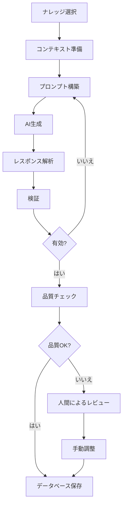

# 21. AI問題自動生成機能

## 関連ドキュメント

- [ナレッジベース総合設計](./page-24-knowledge-base-comprehensive-design.md) - システムアーキテクチャ、データベース構造、詳細設計仕様

## 概要

ExamForgeのAI問題自動生成機能は、ナレッジベースシステムを活用して高品質で文脈に即したクイズ問題を自動生成する機能です。教師、企業研修担当者、塾講師などがコンテンツから効率的に問題を作成できます。

## 機能概要

### 対象ユーザーとユースケース

1. **教師・教育関係者**
   - 授業資料やカリキュラムから問題を自動生成
   - 章末テストや小テストの迅速な作成
   - 難易度別の練習問題の生成

2. **企業研修担当者**
   - 研修マニュアルからの理解度確認問題の作成
   - コンプライアンステストの自動生成
   - 新入社員向けの段階的な学習問題の作成

3. **塾講師・家庭教師**
   - 個々の生徒に合わせた練習問題の生成
   - 弱点克服のための集中問題の作成
   - 模擬試験問題の効率的な作成

## 主要機能

### 1. ナレッジベース管理
- **ナレッジドメイン**: 教科・分野別のコンテンツ整理
- **ナレッジエントリー**: 個別の知識単位の管理
- **階層的な知識構造**: トピックとサブトピックの関連付け
- **メタデータ管理**: 難易度、重要度、学習目標の設定

### 2. AI生成エンジン

#### 問題タイプ別ジェネレーター
```typescript
// 問題タイプ別のジェネレーター
interface QuestionGenerator {
  generateQuestions(params: GenerationParams): Promise<GeneratedQuestion[]>
  validateQuestion(question: Question): Promise<ValidationResult>
  enhanceQuestion(question: Question): Promise<Question>
  calibrateDifficulty(question: Question): Promise<DifficultyLevel>
}
```

対応する問題タイプ：
- **基本タイプ**: マルバツ、択一選択、複数選択、記述式
- **高度なタイプ** (プロプラン): 穴埋め、並べ替え、マッチング、図表問題

### 3. 生成パラメータ設定

```typescript
interface GenerationParams {
  knowledgeEntryIds: string[]     // 選択したナレッジエントリー
  templateId: string              // 使用するテンプレート
  count: number                   // 生成する問題数
  questionTypes?: QuestionType[]  // 問題タイプの指定
  difficulty?: DifficultyLevel    // 難易度レベル
  language?: string               // 言語設定
  customInstructions?: string     // カスタム指示
}
```

### 4. 品質管理システム

#### 自動検証機能
- **文法チェック**: 問題文の文法的正確性
- **明確性チェック**: あいまいさのない明確な表現
- **正答精度チェック**: ナレッジベースとの整合性確認
- **難易度較正**: 設定難易度との一致確認
- **バイアスチェック**: 偏見や不適切な内容の検出
- **重複チェック**: 既存問題との類似性確認

#### 品質スコアリング
```typescript
interface QualityMetrics {
  grammarScore: number      // 文法スコア (0-100)
  clarityScore: number      // 明確性スコア (0-100)
  accuracyScore: number     // 正確性スコア (0-100)
  difficultyMatch: number   // 難易度適合度 (0-100)
  overallScore: number      // 総合スコア (0-100)
}
```

## 画面設計

### 1. AI生成モーダル

```
┌─────────────────────────────────────────────┐
│ AI問題生成                              [×] │
├─────────────────────────────────────────────┤
│                                             │
│ ▼ ナレッジベース選択                       │
│ ┌─────────────────────────────────────┐   │
│ │ ☑ 第3章: 細胞の構造と機能          │   │
│ │ ☑ 第4章: 遺伝の基礎                │   │
│ │ ☐ 第5章: 進化と多様性              │   │
│ └─────────────────────────────────────┘   │
│                                             │
│ ▼ 生成設定                                 │
│ 問題数: [10 ▼]                             │
│ 問題タイプ:                                │
│   ☑ 択一選択  ☑ マルバツ  ☐ 記述式      │
│ 難易度: [中級 ▼]                           │
│                                             │
│ ▼ 詳細オプション                           │
│ テンプレート: [標準テンプレート ▼]         │
│ カスタム指示:                              │
│ ┌─────────────────────────────────────┐   │
│ │ 図表を使った応用問題を含める        │   │
│ └─────────────────────────────────────┘   │
│                                             │
│ [キャンセル]              [問題を生成] 🤖   │
└─────────────────────────────────────────────┘
```

### 2. 生成進捗表示

```
┌─────────────────────────────────────────────┐
│ 問題を生成中...                             │
├─────────────────────────────────────────────┤
│                                             │
│ 🤖 AIが問題を生成しています                 │
│                                             │
│ 進捗: ████████░░░░░░░░ 8/10                │
│                                             │
│ ✓ ナレッジベースの分析完了                 │
│ ✓ コンテキストの準備完了                   │
│ ✓ 問題生成中 (80%)                         │
│ ○ 品質チェック待機中                       │
│                                             │
│ 予想残り時間: 約15秒                       │
│                                             │
│                              [キャンセル]   │
└─────────────────────────────────────────────┘
```

### 3. レビュー画面

```
┌─────────────────────────────────────────────┐
│ 生成された問題のレビュー                    │
├─────────────────────────────────────────────┤
│ 10問が生成されました (品質スコア: 92/100)   │
│                                             │
│ ┌─────────────────────────────────────┐   │
│ │ 問題 1/10                    ✓承認 │   │
│ │                                     │   │
│ │ 細胞膜の主要な構成成分は？         │   │
│ │ A) タンパク質と脂質 ✓             │   │
│ │ B) 炭水化物と核酸                  │   │
│ │ C) ビタミンとミネラル              │   │
│ │ D) 水と塩類                        │   │
│ │                                     │   │
│ │ 品質: ████████░░ 85%               │   │
│ │ 難易度: 中級                       │   │
│ │                                     │   │
│ │ [編集] [削除] [次の問題 →]         │   │
│ └─────────────────────────────────────┘   │
│                                             │
│ [すべて破棄]  [選択した問題を追加] (8問)   │
└─────────────────────────────────────────────┘
```

## システムアーキテクチャ

### 1. AIサービス層

```typescript
// コアAIサービスインターフェース
interface AIQuestionGenerator {
  generateQuestions(params: GenerationParams): Promise<GeneratedQuestion[]>
  validateQuestion(question: Question): Promise<ValidationResult>
  enhanceQuestion(question: Question): Promise<Question>
  calibrateDifficulty(question: Question): Promise<DifficultyLevel>
}
```

### 2. AIプロバイダー抽象化

複数のAIサービスに対応するプロバイダーインターフェース：
- OpenAI (GPT-4, GPT-3.5)
- Anthropic (Claude)
- Google (Gemini)

```typescript
interface AIProvider {
  name: string
  generateCompletion(prompt: string, options: AIOptions): Promise<AIResponse>
  generateEmbedding(text: string): Promise<number[]>
  moderateContent(content: string): Promise<ModerationResult>
}
```

### 3. 問題生成パイプライン



### 4. プロンプトエンジニアリング

```typescript
class PromptEngine {
  async constructPrompt(
    template: QuestionTemplate,
    context: GenerationContext,
    params: GenerationParams
  ): Promise<string> {
    // テンプレートベースのプロンプト生成
    // 変数置換
    // 例示の追加
    // 言語設定の適用
  }
}
```

## プラン別機能制限

### フリープラン
- AI生成：利用不可
- ナレッジベース：利用不可

### プロプラン
- AI生成：月100問まで
- ナレッジベース：10エントリーまで
- 基本的な問題タイプのみ
- 標準テンプレートのみ

### プレミアムプラン
- AI生成：月1000問まで
- ナレッジベース：無制限
- すべての問題タイプ対応
- カスタムテンプレート作成可能
- 高度な品質管理機能
- バッチ生成機能

## API仕様

### 問題生成エンドポイント

```typescript
// 問題生成
POST /api/ai/generate-questions
{
  "knowledgeEntryIds": ["entry1", "entry2"],
  "templateId": "template1",
  "count": 10,
  "questionTypes": ["MULTIPLE_CHOICE", "TRUE_FALSE"],
  "difficulty": "INTERMEDIATE"
}

// レスポンス
{
  "jobId": "job123",
  "status": "processing",
  "estimatedTime": 30
}

// 生成ステータス確認
GET /api/ai/generation-jobs/:jobId

// レスポンス
{
  "status": "completed",
  "questions": [...],
  "metrics": {
    "generated": 10,
    "validated": 9,
    "qualityScore": 92
  }
}
```

### WebSocketによるリアルタイム更新

```typescript
// 生成進捗の通知
ws.on('generation:progress', (data) => {
  console.log(`生成完了: ${data.completed}/${data.total}`)
})

ws.on('generation:complete', (data) => {
  console.log(`生成完了: ${data.questions.length}問`)
})
```

## パフォーマンス最適化

### 1. キャッシング戦略
- 生成された問題のコンテンツハッシュによるキャッシュ
- 埋め込みベクトルのキャッシュ
- テンプレートの事前コンパイル

### 2. コスト最適化
- 難易度に応じたモデル選択
- バッチ処理による効率化
- 類似リクエストの統合

### 3. 並列処理
- 非同期生成による高速化
- レート制限を考慮した並列度調整
- キューイングシステムの実装

## セキュリティとコンプライアンス

### 1. コンテンツフィルタリング
- 不適切なコンテンツの検出と除外
- 個人情報（PII）の検出と除去
- 著作権侵害の可能性がある内容のチェック

### 2. 監査ログ
- すべてのAI生成操作の記録
- コスト追跡
- 使用状況の分析

### 3. データプライバシー
- ナレッジベースの暗号化
- アクセス制御
- データ保持ポリシーの適用

## 関連ページ

- [page-07: クイズエディター](./page-07-quiz-editor.md) - AI生成した問題の編集
- [page-15: 問題バンク](./page-15-question-bank.md) - 生成した問題の保存・管理
- [page-20: 詳細プレビュー](./page-20-quiz-preview.md) - 生成した問題のプレビュー

## 今後の拡張予定

1. **高度な機能**
   - マルチモーダル問題生成（画像、図表を含む問題）
   - 学習者の成績に基づく適応的問題生成
   - 多言語問題生成
   - フィードバックに基づく問題の進化

2. **統合機能**
   - LMS統合による自動クイズ作成
   - 講義中のリアルタイム問題生成
   - パーソナライズされた練習問題生成
   - 協調的な問題改善機能

3. **AIモデルの改善**
   - 特定科目向けのファインチューニング
   - 学生の成績からの強化学習
   - 問題検証のためのマルチエージェントシステム
   - 自動問題改善提案